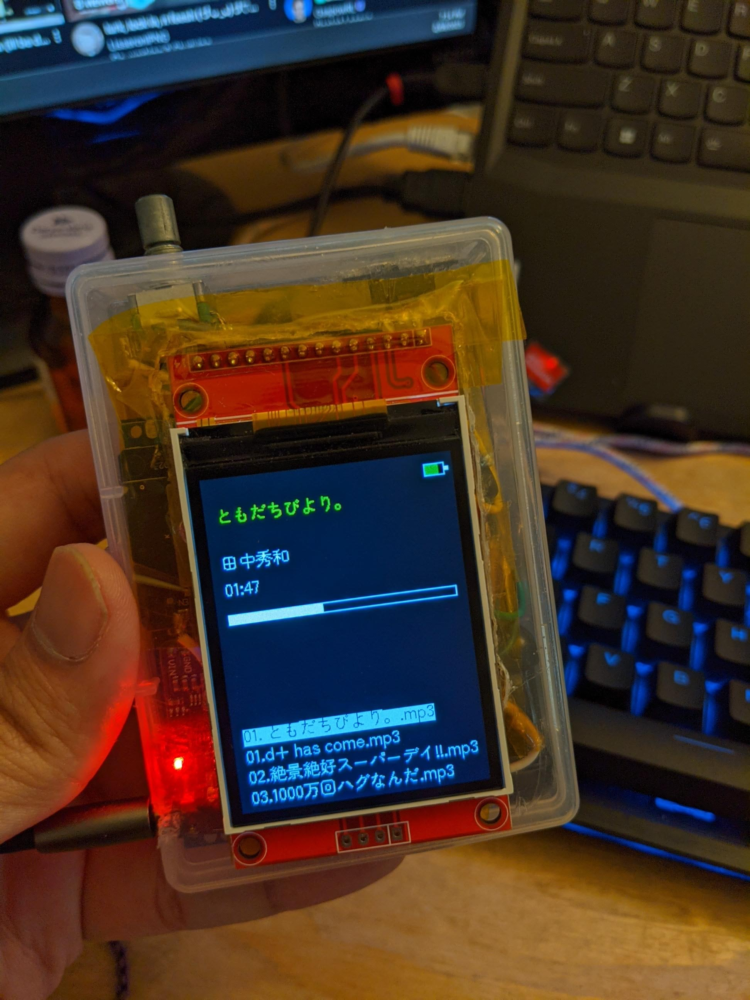
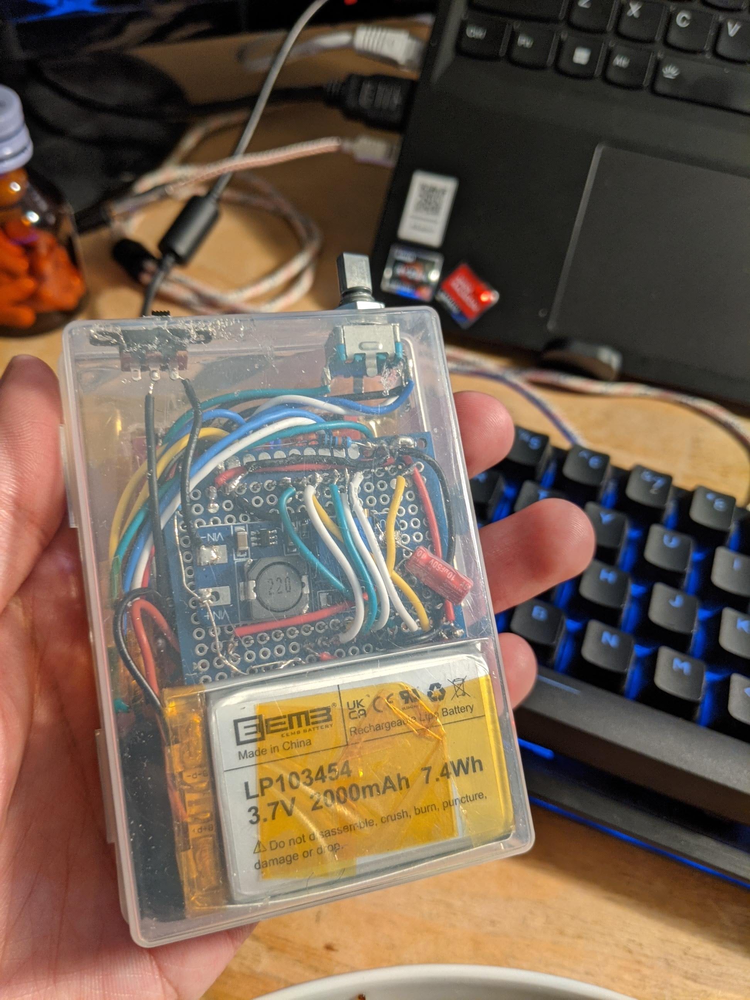

# ESP32 Music Player

A simple portable music player built with an ESP32, inspired by classic iPods and MP3 Players.  
This project was a way to explore I²S audio and the [ESP32-audioI2S](https://github.com/schreibfaul1/ESP32-audioI2S) library.

---

## Demo Video

---

## Hardware Used
- ESP32  
- PCM5102 DAC  
- TFT Screen (ST7789)  
- 2000mAh Li-Po Battery  
- TP4056 charger  
- MT3608 boost module
- 2x 1N5817 diodes  
- SPDT switch  
- Encoder with button
- 100k & 47k resistor for voltage divider
- SD card slot
---

## Features
- Play music via I²S using the ESP32
	- supports .mp3 and .wav
- TFT screen for user interface
	- Metadata taken from mp3 file
	- Batter indicator
- Rechargeable Li-Po battery power  
- Custom font to support Japanese characters
- Auto-scan music folder from SD card

---

## Project Goals
- Learn the basics of I²S on ESP32  
- Create a standalone portable music player  
- Experiment with audio libraries and embedded UI  

---

## Images
  
  

---

## Future Improvements
- Better enclosure 
- Integrate to PCB
- Revise on the controls
- Upgrade to ESP32-S3 for FLAC support
